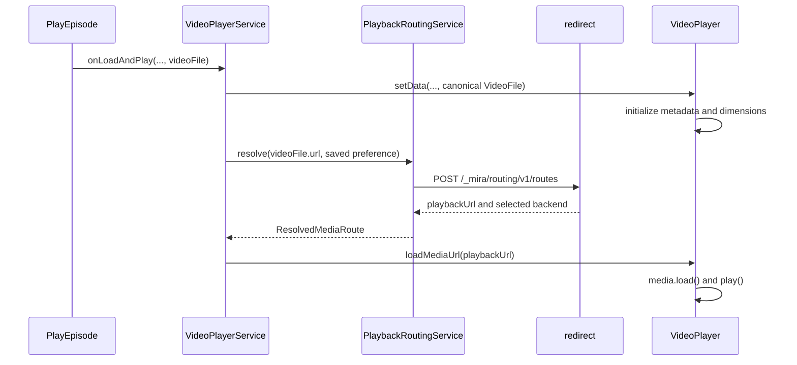

# Mira UI Signed Routing Integration

> Status: Automatic and node-preference slice implemented
>
> Last updated: 2026-08-07
>
> Depends on: `irohalab/redirect` routing API v1

Implemented in Mira UI:

- automatic signed route resolution with canonical fallback;
- exact-node preference persisted in browser storage;
- normal and touch player settings controls;
- active selected-node display;
- same-video source reload with playback position preservation;
- stale request suppression, short timeout, backend catalog cache, and
  short-lived unsupported-origin suppression.

Not yet implemented:

- location preference, pending `redirect` region-mode support; and
- automatic media-error/stall failover with exclusions.

## 1. Summary

Mira UI initializes `VideoFile` metadata and player dimensions immediately, then
resolves a signed route before assigning the media source URL to the native
`<video>` element. Automatic mode asks `redirect` to choose a healthy backend.
The deployed API also lets the user prefer a specific node. A follow-up
`redirect` change will add location preference. The returned `playbackUrl`
remains on redirect ingress and contains the signed `__mira_route` query
parameter.

The initial UI should place routing controls in the video player's existing
settings popover. Automatic mode is the default and requires no user action.
A compact `播放线路` row shows the current choice and opens a dedicated selector.
The first Mira release exposes:

- `自动（推荐）`
- `按节点选择`

After `redirect` supports region preference, the same selector adds:

- `按地区选择`

The preference is stored in browser-local `PersistStorage`. It is not initially
stored on the account because the best route depends on the user's current
network. The selected backend and signed route are playback-session state and
are never persisted.

## 2. Product Decisions

### 2.1 Control placement

Use the player settings popover for the first release.

Reasons:

- Route choice affects playback and is easiest to understand while watching.
- The popover already owns persisted player preferences.
- The existing normal-player settings button provides a natural entry point.
- It does not make a network-dependent choice look like an account-wide
  identity setting.
- Automatic mode keeps the normal interface quiet.

The current floating controls do not contain a settings entry. A route selected
before entering floating mode remains active, but changing it requires returning
to the normal player in the first release. Adding a compact floating-player
entry can be evaluated later rather than expanding this scope.

Do not add the same full control to both the playback page and user settings.
Two surfaces create unclear ownership and synchronization behavior.

If the compact popover cannot comfortably display the node list, its
`播放线路` row should open a second popover or small dialog. Do not expand the
existing toggle list into a long nested menu.

### 2.2 Preference semantics

| Mode | Meaning |
| --- | --- |
| Automatic | Let `redirect` select a backend using its current automatic policy. |
| Location | Target behavior after server support: ask `redirect` to choose a backend within the selected region. |
| Node | Prefer one exact backend ID. If unavailable, allow server-side fallback. |

Manual choices are preferences, not commands to use an offline node. The UI
must display the backend actually returned by route resolution.

### 2.3 Persistence

Persist only the preference:

```ts
type RoutingPreference =
    | {mode: 'auto'}
    | {mode: 'region'; region: string}
    | {mode: 'backend'; backendId: string};
```

Do not persist:

- `routeToken`
- `playbackUrl`
- `selectedBackend`
- excluded/failed backends
- automatic latency or network observations

The existing `PersistStorage` clears local settings when the signed-in user
changes. That behavior is acceptable for the first release.

## 3. Redirect Contract Used By Mira

`mira-streaming-platform` returns an absolute canonical media URL. For ordinary
`/video/` resources, the URL uses the configured video domain; when that setting
is empty, the backend uses the origin of `siteRoot`. The media/redirect origin
may therefore differ from the Mira UI website origin.

Mira must derive the routing API from the absolute media URL, not from
`window.location` or the content API origin:

```ts
const resourceUrl = new URL(videoFile.url);
const backendsUrl = new URL('/_mira/routing/v1/backends', resourceUrl.origin);
const routesUrl = new URL('/_mira/routing/v1/routes', resourceUrl.origin);
```

For example, a page at `https://mira.example.com` may receive this media URL:

```text
https://media.example.com/video/example/file.mp4
```

Both routing API requests then go to `https://media.example.com`. The redirect
deployment must list `https://mira.example.com` in `AllowedOrigins`.

The deployment settings must agree:

```yaml
# mira-streaming-platform
siteRoot: https://mira.example.com
domain:
  video: https://media.example.com
```

For `redirect`:

```json
{
  "Routing": {
    "PublicOrigin": "https://media.example.com",
    "AllowedOrigins": ["https://mira.example.com"]
  }
}
```

The public media origin must expose both its resource paths and
`/_mira/routing/v1/*`. Resource paths can be legacy `/video/*` paths or S3 HTTP
paths such as `/public-video/*`. If the canonical media origin and
`PublicOrigin` do not match, Mira rejects the returned playback URL and uses the
canonical URL.

The route request must submit a same-origin absolute path, not the full URL:

```ts
const resource = `${resourceUrl.pathname}${resourceUrl.search}`;
```

Reject a relative or malformed `videoFile.url` as an API contract error. Do not
hard-code a resource-path prefix in Mira: S3-backed URLs can use bucket paths
instead of `/video/`. Mira submits the canonical path to the routing API and
`redirect` decides whether it is allowed through `AllowedResourcePrefixes`.
Suppress an origin that does not expose routing API v1 for one minute so
subsequent requests do not immediately repeat a failed request while a temporary
public-proxy problem can still recover.

Current deployed request modes are:

```json
{
  "resource": "/video/example/file.mp4",
  "preference": {"mode": "auto"},
  "excludeBackendIds": []
}
```

```json
{
  "resource": "/video/example/file.mp4",
  "preference": {
    "mode": "backend",
    "backendId": "jp-example"
  },
  "excludeBackendIds": []
}
```

The current server does not support a `region` request mode. Location selection
therefore requires a small follow-up change in `redirect`; see section 10.

Successful route creation returns HTTP `201`:

```json
{
  "routeToken": "payload.signature",
  "playbackUrl": "https://media.example.com/video/example/file.mp4?__mira_route=payload.signature",
  "selectedBackend": {
    "id": "jp-example",
    "label": "Japan Example",
    "region": "JP",
    "availability": "healthy",
    "selectable": true
  },
  "selection": {
    "mode": "auto",
    "reason": "main-group"
  },
  "issuedAt": "2026-08-07T12:00:00Z",
  "freshUntil": "2026-08-08T12:00:00Z",
  "expiresAt": "2026-08-14T12:00:00Z"
}
```

Mira should use the validated `playbackUrl` directly. It must not decode or
reconstruct the token and must not expect a backend URL in API responses. Before
use, verify that the returned URL has the canonical origin and path and that its
raw query is the canonical raw query plus exactly one matching
`__mira_route=<routeToken>` pair.

## 4. Frontend Model

Add a small routing domain under `src/app/video-player/routing/`:

```text
routing/
  playback-routing.models.ts
  playback-routing.service.ts
  playback-routing.service.spec.ts
```

Suggested models:

```ts
export interface RoutingBackend {
    id: string;
    label: string;
    region?: string;
    availability: 'healthy' | 'offline' | string;
    selectable: boolean;
}

export interface BackendListResponse {
    version: number;
    backends: RoutingBackend[];
}

export type RoutingPreference =
    | {mode: 'auto'}
    | {mode: 'region'; region: string}
    | {mode: 'backend'; backendId: string};

export interface RouteResolution {
    routeToken: string;
    playbackUrl: string;
    selectedBackend: RoutingBackend;
    selection: {
        mode: string;
        reason: string;
    };
    issuedAt: string;
    freshUntil: string;
    expiresAt: string;
}

export interface ResolvedMediaRoute {
    canonicalUrl: string;
    playbackUrl: string;
    selectedBackend?: RoutingBackend;
    routed: boolean;
}
```

The service should expose:

```ts
listBackends(canonicalUrl: string): Observable<RoutingBackend[]>;

resolve(
    canonicalUrl: string,
    preference: RoutingPreference,
    excludeBackendIds?: string[]
): Observable<ResolvedMediaRoute>;
```

`resolve()` must convert errors into a direct fallback result unless the caller
explicitly asks for strict diagnostics:

```ts
{
    canonicalUrl,
    playbackUrl: canonicalUrl,
    routed: false
}
```

Routing is an enhancement, not a new requirement for playback.

## 5. State Ownership

Use three distinct state scopes.

### 5.1 Persisted preference

Owned by `PlaybackRoutingService` and `PersistStorage`.

Suggested storage key:

```text
VideoPlayer:Routing:Preference
```

Store one JSON value. On missing or invalid JSON, return `{mode: 'auto'}` and
remove or overwrite the invalid value on the next change.

### 5.2 Backend catalog

Owned by `PlaybackRoutingService` and cached per redirect origin for a short
period, for example five minutes. The server response is `private, no-store`, so
this is an application-memory cache only; do not persist it.

Refresh when:

- the selector opens after the cache expires;
- route resolution returns a preferred-backend error;
- the user explicitly retries; or
- the current preferred node no longer exists in a fresh catalog.

### 5.3 Active route

Owned by `VideoPlayerService` for the current media resource:

```ts
interface ActivePlaybackRoute {
    canonicalUrl: string;
    playbackUrl: string;
    backend?: RoutingBackend;
    failedBackendIds: string[];
    failoverAttempts: number;
}
```

Discard it when the video file changes or the player is destroyed. Preserve it
when the same player is merely reattached for floating playback.

## 6. Player Integration

### 6.1 Initialize metadata before resolving the source

`VideoPlayerService` passes the canonical `VideoFile` to `setData()`
synchronously. That initializes titles, resolution, start position, and player
dimensions without waiting for a network request. Route resolution changes only
`mediaUrl`; it does not replace the `VideoFile` or recalculate metadata/layout.

Preferred flow:



`VideoPlayerService.onLoadAndPlay()` currently returns `void`. It should own the
asynchronous route request and cancel stale requests when navigation or video
selection changes. Use RxJS `switchMap` or an explicit monotonically increasing
load ID so a slow response for the previous episode cannot replace the current
source.

The service must also fix its same-episode branch: a preference change or
failover for the same `VideoFile.id` still needs to update the media source.

### 6.2 Loading behavior

While route resolution is pending, keep the existing player loading state. Add
a short client timeout, recommended two to three seconds. On timeout, API error,
invalid response, or CORS/network failure, load the canonical URL directly.

Do not wait for `GET /backends` before automatic playback. Route resolution is
sufficient. The backend catalog is only needed when rendering manual choices.

### 6.3 Preference changes during playback

When the user selects a different mode/location/node:

1. Persist the preference.
2. Save current playback position and whether the player is playing.
3. Resolve the canonical URL with the new preference.
4. Replace the source URL.
5. Call `load()`.
6. Restore position after `loadedmetadata`.
7. Start playback using the player's normal load-and-play behavior.

Do not navigate or reload the Angular page.

## 7. UI Design

### 7.1 Compact row in player settings

Add a command row below the current toggles:

```text
播放线路             自动（推荐）  >
当前节点             Japan Example
```

The first row opens the selector. The current-node row appears only after route
resolution and is informational. Use a familiar chevron/icon control with a
tooltip where the existing icon library provides one.

### 7.2 Selector contents

Use a segmented mode control or three tabs:

```text
[ 自动 ] [ 地区 ] [ 节点 ]
```

Automatic view:

- One selected option: `自动（推荐）`
- Show the currently resolved node below it when available.

Location view:

- Derive visible locations from non-empty `backend.region` values.
- Display friendly location names using a frontend map, for example `JP` to
  `日本` and `US` to `美国`.
- Show the count of currently healthy nodes in each location.
- Disable a location when it has no healthy selectable node.

Node view:

- Group nodes by `region`.
- Show `backend.label`; use `backend.id` only as a secondary diagnostic label.
- Disable nodes whose `availability` is not `healthy`.
- Mark the active backend separately from the saved preference, because server
  fallback may choose another backend.

Provide retry/error state inside the selector. Do not show a toast every time
automatic routing falls back to the canonical URL; playback should continue
quietly. Show a concise warning only when the user explicitly selects a node or
location and it cannot be honored.

### 7.3 Why not personal settings first

A personal-settings page is suitable later for syncing an explicit default,
but it is not the best first surface:

- network conditions vary by device and location;
- the user needs to change the route while diagnosing playback;
- account synchronization does not exist for this preference; and
- the existing user-center page is account-oriented rather than playback-
  oriented.

## 8. Failure And Failover

### 8.1 Initial resolution failure

If route resolution fails, play `videoFile.url` unchanged. Record an internal
diagnostic but do not block playback.

### 8.2 Media error

Add a native `error` event output from `VideoPlayer`. On error:

1. If the active route has a backend, add its ID to `failedBackendIds`.
2. Resolve again with those exclusions.
3. Reload and restore playback state.

### 8.3 Sustained stall

The player already emits `lagged`. In the first implementation, do not
immediately switch on every lag event. Trigger failover only when:

- the stall exceeds the existing tolerance;
- the player is not seeking;
- no failover is already in progress; and
- the cooldown and attempt limit permit it.

Recommended guardrails:

- maximum two automatic failovers per canonical resource;
- at least 30 seconds between failover attempts;
- keep failed backend IDs only for the active playback;
- never exclude more than the API limit of 16 IDs.

If all route attempts fail, return to the canonical URL once and stop automatic
failover. Avoid a reload loop.

### 8.4 Manual fallback message

When `selection.reason` is `preferred-backend-unavailable`, keep playing the
returned URL and show a non-blocking message in the selector:

```text
首选节点当前不可用，已使用 Japan Example
```

## 9. HTTP And Security Rules

- Send routing requests with credentials omitted. This deliberately ignores the
  old `group` cookie so the visible Mira preference is the only manual routing
  state. The server checks that cookie first only when a client sends it.
- Do not attach the Mira API bearer token to the redirect origin.
- Do not log the full `routeToken` or `playbackUrl`.
- Do not decode the token in the client.
- Do not append another `__mira_route` parameter manually; always use the URL
  returned by the API.
- Accept only HTTP `201` with a valid route response. Treat every other status,
  including a legacy `200` status-array response when routing is disabled, as
  routing-unavailable and use the canonical URL for playback.
- `403`, `404`, `405`, `429`, and `5xx` are common public-proxy or routing API
  failures, but clients must not depend on one particular failure status.
- For `429`, the UI may honor `Retry-After`, but playback must still continue
  directly.
- Preserve `videoFile.url` as the canonical retry source.

## 10. Required Redirect Addition For Location Mode

The deployed API currently accepts only `auto` and `backend`. To support the
product requirement without moving selection policy into Mira, extend it with:

```json
{
  "resource": "/video/example/file.mp4",
  "preference": {
    "mode": "region",
    "region": "JP"
  },
  "excludeBackendIds": []
}
```

Suggested server behavior:

1. Add an explicit routing configuration map from public region code to an
  existing weighted group, for example:

  ```json
  "RegionGroups": {
    "CN": "main",
    "JP": "japan",
    "US": "united-states"
  }
  ```

2. Validate that `region` is non-empty and has a configured group.
3. Select from that group using its existing weights, health state, nested
  groups, and request exclusions.
4. Ensure the selected concrete server's public `Region` matches the requested
  region; reject inconsistent configuration at startup.
5. If no matching backend is available, use normal automatic fallback and
   return reason `preferred-region-unavailable`.

The backend-list response already contains `region`, so no catalog schema
change is needed.

Use one stable public region code for every node in a region group. For example,
use `CN` if the UI choice is China as a whole. If the product needs separate
Beijing and Shanghai choices, create separate groups and use codes such as
`CN-BJ` and `CN-SH`.

Do not have Mira choose a random healthy node from the list. That would bypass
server-side weights, health races, future scoring, and consistent policy for
other clients.

Mira implementation can land in two steps:

1. Automatic plus exact-node selection using the deployed API.
2. Enable the location tab after `redirect` accepts `mode: region`.

## 11. Implementation Slices

### Slice 1: Routing client and automatic mode

- Add routing models and `PlaybackRoutingService`.
- Add canonical-to-resource URL conversion.
- Add automatic route resolution with timeout and direct fallback.
- Initialize `VideoFile` metadata synchronously, then resolve and assign only
  the media source URL.
- Add service tests for same-origin, cross-origin, timeout, and stale response
  cancellation.

### Slice 2: Manual node UI

- Add persisted `RoutingPreference` key.
- Add backend catalog loading and caching.
- Add compact player-settings row and node selector.
- Re-resolve the active source without page navigation.
- Display actual selected backend and manual fallback reason.

### Slice 3: Region preference

- Add `region` mode to `redirect` and its contract tests.
- Enable location tab in Mira.
- Add region grouping/friendly labels.

### Slice 4: Controlled failover

- Add native media-error output.
- Consume `lagged` in `VideoPlayerService`.
- Add exclusion list, cooldown, attempt limit, and playback restoration.
- Add component/service tests with fake media events.

## 12. Test Plan

### Routing service

- Requires an absolute canonical URL and derives the API origin from it.
- Supports a redirect origin different from the Mira UI origin.
- Supports legacy and S3-backed HTTP paths without client-side prefix checks.
- Suppresses unsupported origins for one minute before retrying.
- Sends only path and query in `resource`.
- Sends auto, backend, and later region preference shapes exactly.
- Parses backend list and route response.
- Rejects a returned playback URL unless its origin and path match and its raw
  query equals the canonical raw query plus exactly one matching route token.
- Falls back to canonical URL on timeout, CORS error, malformed response, the
  legacy `200` status-array response, or any non-`201` status.
- Does not send auth headers or credentials.
- Cancels/ignores stale resolution responses.
- Caches backend catalogs per origin and expires them.

### Preference and selector

- Defaults invalid/missing persistence to automatic.
- Persists each mode without route tokens.
- Groups nodes by region and disables offline nodes.
- Distinguishes preferred backend from actual selected backend.
- Handles a removed persisted backend.

### Player

- Uses the resolved URL for first load.
- Uses canonical URL when resolution fails.
- Changes route for the same video without page navigation.
- Restores position and starts playback after a manual change.
- Excludes failed backend on media error.
- Enforces failover cooldown and attempt limit.
- Does not loop after all attempts fail.
- Preserves floating-player state during route changes.

### Browser integration

- Same-origin redirect ingress.
- Separate allowed redirect origin with CORS.
- Automatic route response produces a pinned redirect.
- Manual node selection.
- Manual location selection after server support lands.
- Offline preferred node returns and displays fallback.
- Route API unavailable while canonical playback still works.

## 13. Acceptance Criteria

- Automatic mode is the default and uses a signed `playbackUrl` when route
  resolution succeeds.
- Routing API failure never prevents canonical playback.
- Users can choose and persist an exact node preference.
- Users can choose and persist a location after server region mode is available.
- The UI shows the actual selected backend.
- A preference change reloads the current media without navigating away and
  preserves playback position/state.
- Signed tokens and playback URLs are not persisted or logged.
- Existing video-source selection and floating playback continue to work.
- The initial route selector is available in normal player controls; an active
  route continues when the player enters floating mode.
- Unrelated admin components are unchanged.

## 14. Relevant Mira Files

- `src/app/home/play-episode/play-episode.component.ts`
- `src/app/video-player/video-player.service.ts`
- `src/app/video-player/video-player.component.ts`
- `src/app/video-player/video-player.html`
- `src/app/video-player/core/settings.ts`
- `src/app/video-player/controls/config-button/config-panel/config-panel.component.ts`
- `src/app/video-player/controls/config-button/config-panel/config-panel.html`
- `src/app/video-player/controls/config-button/config-panel/config-panel.less`
- `src/app/user-service/persist-storage.ts`
