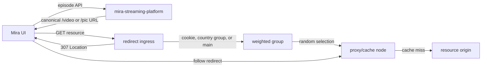
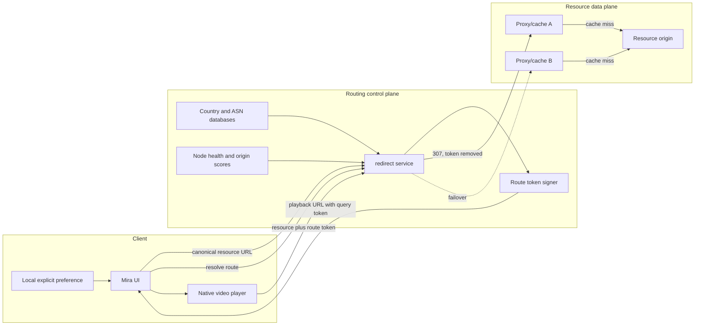
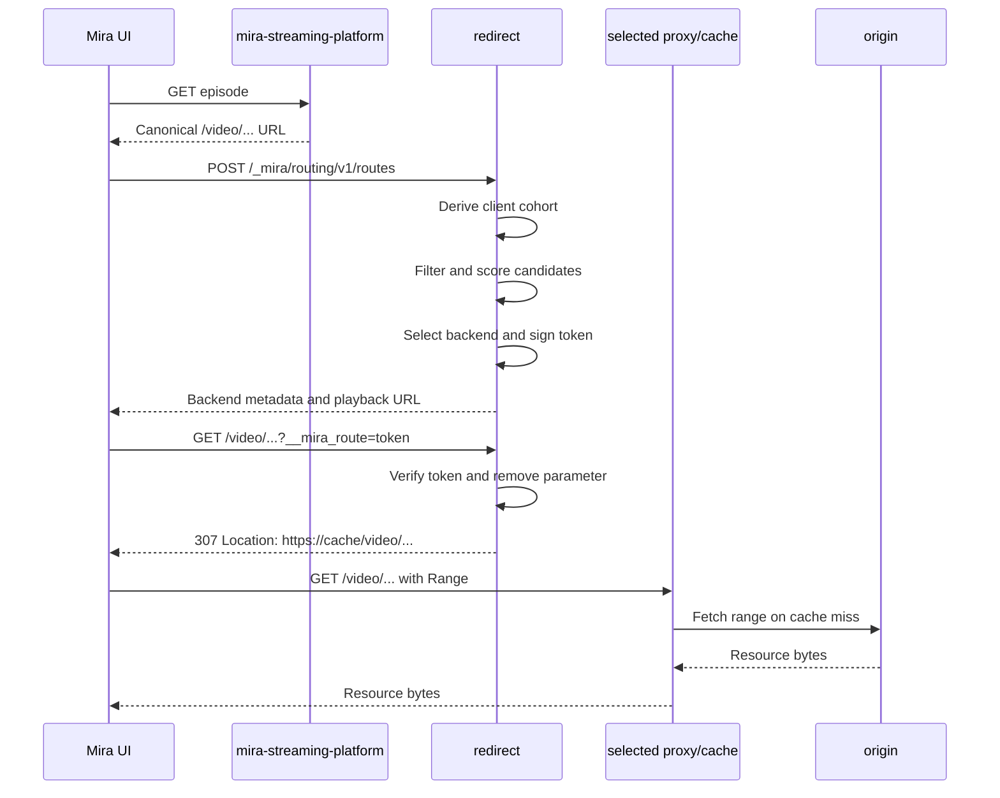
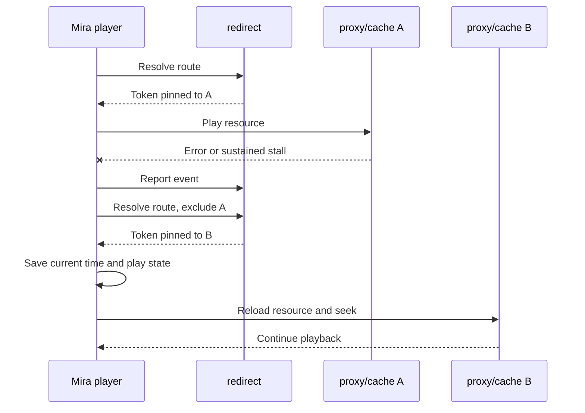

# Mira Proxy and Cache Backend Routing Design

> Status: Draft for discussion
>
> Last updated: 2026-07-31
>
> Systems: `mira-ui`, `mira-streaming-platform`, and
> [`irohalab/redirect`](https://github.com/irohalab/redirect)

This document describes the long-term architecture. The signed route API v1 is
now deployed. Use [Mira UI Signed Routing Integration](mira-ui-routing-integration.md)
for the implementation plan and [Signed Routing Client Integration Guide](signed-routing-client-guide.md)
for the current client protocol.

## 1. Summary

Mira serves image and video URLs through a small redirect load balancer. The
load balancer selects a proxy/cache node and returns an HTTP `307` redirect to
that node. The current weighted-random policy can send requests for the same
resource to different caches, which reduces cache locality and can make video
range requests use nodes with inconsistent connectivity.

This proposal adds stable, observable, and user-controllable routing while
preserving the existing resource URLs and legacy clients.

The main decisions are:

1. The `redirect` service owns backend selection and route-token signing. It is
   the component that sees the client connection and owns node health.
2. Canonical resource paths remain unchanged. An updated client adds an
   optional `__mira_route` query parameter instead of changing the pathname.
3. Requests without `__mira_route` remain supported. Existing cookie, IP-group,
   and `main` fallback behavior remains available to uncontrolled clients.
4. A valid route token pins a playback resource to a selected proxy/cache. The
   redirect service removes the token before constructing the `Location`
   response, so proxy, cache, and origin configurations do not see it.
5. Automatic selection combines network cohort, node health, proxy-to-origin
   quality, configured capacity, and resource affinity. It does not rely on
   client ping alone.
6. Explicit user preference is stored locally by Mira UI and sent when a route
   is resolved. Account synchronization is optional and only applies to an
   explicit preference, not learned network measurements.
7. Proxy-to-origin scoring starts with portable synthetic probes. Passive
   Nginx or Caddy metrics can be added later without making either server a
   requirement.

## 2. Terminology

| Term | Meaning |
| --- | --- |
| Canonical resource URL | The image or video URL returned by `mira-streaming-platform`. It points to the public redirect ingress, not directly to a cache node. |
| Redirect ingress | The public domain or same-origin path that reaches the `redirect` service. |
| Proxy/cache node | A server selected by `redirect`; it serves a cache hit or fetches the resource from the origin. |
| Origin | The authoritative image/video resource server behind the proxy/cache nodes. |
| Route token | A signed, short-lived routing hint that identifies a selected backend and is bound to a resource. It is not an authorization credential. |
| Network cohort | A coarse client network group, initially country plus ASN, such as `JP-AS2516`. |
| Resource affinity | Deterministically preferring the same cache for the same resource and network cohort. |

## 3. Context and Constraints

### 3.1 Canonical URL ownership

`mira-streaming-platform` generates canonical resource URLs. Its configured
image and video domains identify the redirect ingress:

- A configured domain produces an absolute URL pointing to redirect ingress.
- When a domain is empty, the backend falls back to the origin of `siteRoot`, so
  ordinary `/video/...` and `/pic/...` URLs are still absolute.
- The configured domain is not a selected proxy/cache node and is not the
  resource origin.
- S3-backed HTTP URLs can use bucket paths instead of `/video/`; client routing
  eligibility is based on whether their origin exposes the routing API, while
  `redirect` validates configured path prefixes.

This responsibility should not change. Content metadata should not contain a
transient proxy choice.

### 3.2 Client and deployment constraints

- Mira currently binds `VideoFile.url` directly to a native HTML `<video>`
  element. The browser follows the `307`, but JavaScript does not learn which
  backend was selected.
- Video playback uses range requests. Re-running random selection for later
  requests can move one playback between cache nodes.
- Some clients are not controlled by the Mira project and cannot be upgraded.
- Production currently uses same-origin `/video` URLs, but a separate redirect
  origin is a supported deployment mode.
- `mira-streaming-platform` cannot currently be relied on to observe the real
  client IP. Route selection must not depend on it doing so.
- Proxy/cache nodes may use Nginx, Caddy, or another HTTP server.
- Traffic volume is relatively low, so cache locality and sensible behavior
  with small metric sample sizes matter more than perfectly even random load.

### 3.3 Existing Mira integration points

- The player URL is assigned in
  [`video-player.component.ts`](../src/app/video-player/video-player.component.ts).
- The native media element is declared in
  [`video-player.html`](../src/app/video-player/video-player.html).
- The player already emits a lag signal after prolonged buffering, but
  [`video-player.service.ts`](../src/app/video-player/video-player.service.ts)
  does not currently consume it.
- User settings can use
  [`PersistStorage`](../src/app/user-service/persist-storage.ts).
- Local development sends `/video` and `/pic` to a single ingress through
  [`proxy.conf.json`](../proxy.conf.json).

## 4. Goals

1. Keep a video playback on one healthy backend across initial and range
   requests.
2. Improve cache hit rate by assigning the same resource and network cohort to
   the same cache when practical.
3. Prefer nodes that are healthy from the client side and can reach the origin
   reliably.
4. Let a user select a preferred proxy/cache and see which node Mira selected.
5. Recover from startup failures, media errors, and sustained stalls without
   restarting the episode from the beginning.
6. Work when resource URLs use either the Mira origin or a separate redirect
   origin.
7. Preserve protocol compatibility for existing clients and existing proxy,
   cache, and origin configurations.
8. Avoid storing raw client IP addresses or attaching learned network quality
   to a user account.

## 5. Non-goals

- The route token is not media authorization, DRM, or access control.
- This proposal does not change how `mira-streaming-platform` discovers or
  stores video files.
- The first release does not require exact per-object cache introspection.
- The first release does not require a full Prometheus, OpenTelemetry, or log
  analytics deployment.
- Automatic network measurements are not synchronized to a user account.
- The redirect service does not become a data-plane proxy; it continues to
  return redirects.

## 6. Current Architecture



### 6.1 Existing redirect behavior

The current service exposes these operations:

| Request | Existing behavior |
| --- | --- |
| `GET /*` | Select a server and return a redirect. |
| `POST /*` | Return runtime status for all groups and servers. |
| `PUT /:group` | Set the `group` cookie for one year. The value may identify a group or a direct server. |
| `DELETE /` | Delete the `group` cookie. |

Selection precedence is:

1. A valid configured group or server named by the `group` cookie.
2. A group whose name matches the country returned by the IP database.
3. The `main` group.

Groups use either weighted `random` selection or ordered `fallback` selection.
A server is marked offline when `<server URL>/generate_204` does not return
`204 No Content`.

### 6.2 Current limitations relevant to this design

- Weighted random selection is repeated for every request and has no resource
  affinity.
- Health checks measure `redirect -> proxy`, not `proxy -> origin`.
- The HTTP health client has no explicit timeout and response bodies are not
  closed in the current implementation.
- A checked server starts as available before its first successful probe.
- Server status and counters are accessed concurrently without a dedicated
  synchronization policy.
- The status endpoint exposes raw node URLs and is attached to every POST path.
- The current `TotalWeight` status field is never calculated.
- The existing cookie is useful for same-origin manual selection, but is not a
  reliable control mechanism for anonymous cross-origin media requests.

## 7. Proposed Architecture



### 7.1 Responsibility boundaries

| Component | Responsibility |
| --- | --- |
| `mira-streaming-platform` | Return canonical resource URLs that point to redirect ingress. Optionally synchronize an explicit account preference in a later phase. |
| `redirect` | Observe the client connection, perform country/ASN lookup, maintain node scores, select a node, generate and verify route tokens, remove routing parameters, and return `307`. |
| `mira-ui` | Offer automatic/manual selection, request a route, play the returned URL, report coarse playback events, and request failover when needed. |
| Proxy/cache node | Serve cached resources, fetch misses from origin, expose a health/probe path, and optionally export passive proxy metrics. |
| Origin | Serve byte-consistent immutable resources and support range requests. |

`mira-streaming-platform` is deliberately not in the routing hot path and does
not need the client IP.

## 8. Route Resolution

### 8.1 Sequence



### 8.2 Discovering the routing API

Mira derives the routing API origin from the absolute canonical resource URL,
not from the page origin:

```ts
const resourceUrl = new URL(videoFile.url);
const routeApiUrl = new URL('/_mira/routing/v1/routes', resourceUrl.origin);
```

This supports a configured redirect domain that differs from the website
origin. The redirect deployment must allow the website origin through CORS.

### 8.3 Route API

#### List selectable backends

```http
GET /_mira/routing/v1/backends
```

Example response:

```json
{
  "version": 1,
  "backends": [
    {
      "id": "jp-oracle",
      "label": "Japan - Oracle",
      "region": "JP",
      "availability": "healthy",
      "selectable": true
    }
  ]
}
```

The public response must not expose raw backend URLs, internal metrics, or
origin credentials.

#### Resolve an automatic route

```http
POST /_mira/routing/v1/routes
Content-Type: application/json
```

```json
{
  "resource": "/video/bangumi-id/episode.mp4",
  "preference": {
    "mode": "auto"
  },
  "excludeBackendIds": []
}
```

#### Resolve a preferred backend

```json
{
  "resource": "/video/bangumi-id/episode.mp4",
  "preference": {
    "mode": "backend",
    "backendId": "jp-oracle"
  },
  "excludeBackendIds": []
}
```

A manual selection is a preference, not a command to use an offline server. If
the requested backend is unavailable, the service chooses a healthy fallback
and explains that in the response.

#### Route response

```json
{
  "routeToken": "base64url-payload.base64url-signature",
  "playbackUrl": "https://media.example/video/bangumi-id/episode.mp4?__mira_route=base64url-payload.base64url-signature",
  "selectedBackend": {
    "id": "jp-oracle",
    "label": "Japan - Oracle",
    "region": "JP"
  },
  "selection": {
    "mode": "auto",
    "reason": "cohort-resource-affinity"
  },
  "issuedAt": "2026-07-31T15:00:00Z",
  "freshUntil": "2026-08-01T15:00:00Z",
  "expiresAt": "2026-08-07T15:00:00Z"
}
```

Recommended API status behavior:

| Status | Meaning |
| --- | --- |
| `201` | Route created. |
| `400` | Invalid request or resource URL. |
| `422` | Preference or exclusions leave no valid interpretation. |
| `429` | Route-resolution rate limit exceeded. |
| `503` | No healthy backend is currently available. |

If resolution fails because the API is unavailable, blocked by CORS, or has no
healthy candidate, Mira falls back to the original canonical resource URL. The
player therefore remains usable during a partial rollout or routing API outage.

### 8.4 Resource validation

The route API accepts a path and query on its own redirect origin. If an
absolute URL is accepted for client convenience, its origin must exactly match
the routing API origin.

Allowed resource prefixes should be configured, initially:

- `/video/`
- `/pic/`

The route API must not fetch an arbitrary submitted URL or act as an SSRF
endpoint.

## 9. Route Token

### 9.1 Purpose

The token records the result of selection. It is generated after the redirect
service considers the client network and node scores. It is not derived only
from the resource hash.

The resource hash binds the already-selected route to the requested resource.
The selection key and token serve different purposes:

- Selection key: helps choose a backend.
- Resource hash: prevents accidental reuse of a token for another resource.
- Backend claim: pins the selected backend.
- Signature: prevents modification of the claims.

### 9.2 Suggested claims

```json
{
  "v": 1,
  "kid": "2026-07",
  "backend": "jp-oracle",
  "resourceHash": "sha256-of-normalized-path-and-query",
  "iat": 1785510000,
  "freshUntil": 1785596400,
  "exp": 1786114800,
  "jti": "random-route-id"
}
```

The token must not contain:

- Raw client IP
- Country or ASN when it is not required for verification
- Account or OAuth identity
- Origin credentials
- A raw private backend URL

The redirect service should use a compact HMAC-SHA256 token. JWT is acceptable
but not required. All redirect replicas need the current signing key and any
still-valid previous verification keys.

### 9.3 Resource normalization

Before hashing or forwarding, remove only reserved Mira routing parameters.
The same normalization function must be used when issuing and verifying a
token.

At minimum it must:

1. Preserve the escaped resource path.
2. Preserve non-routing query parameters.
3. Remove every `__mira_route` occurrence.
4. Reject ambiguous duplicate route-token parameters.
5. Exclude URL fragments, which are not sent in HTTP requests.

The route API should construct the returned playback URL itself. This avoids a
client and server disagreeing about query canonicalization.

### 9.4 Lifetime

Token lifetime should not be calculated from video duration. Duration does not
account for pauses, seeks, suspended tabs, mobile backgrounding, or returning to
a tab days later.

Recommended configurable defaults are:

| Time | Default | Behavior |
| --- | --- | --- |
| Fresh routing period | 24 hours | Prefer the encoded backend unless it is unavailable. |
| Hard expiration | 7 days | After this time, ignore the token and perform normal selection. Do not reject the media request. |

Mira requests a new token whenever it starts a new player session. It does not
reload an actively playing source only to refresh a token.

During the grace period after `freshUntil`, the encoded backend remains usable
while healthy. Redirect may fall back if it is offline or severely degraded.
After `exp`, the token is treated as absent, allowing a long-paused video to
continue through normal selection instead of failing.

An MVP may use only a seven-day `exp` claim and add `freshUntil` when dynamic
score-based staleness is implemented.

If route tokens ever become authorization credentials, authorization must use
a separate token and lifetime policy. The graceful fallback described here is
appropriate only because this token controls routing, not access.

### 9.5 Key rotation

- Store signing secrets in environment variables, a secret file, or a secret
  manager, not in repository configuration.
- Use at least 256 bits of random key material.
- Include a key ID.
- Sign new tokens with one active key.
- Retain old keys for verification until their maximum token lifetime has
  passed.

## 10. Resource Request Handling

An updated request keeps its original pathname:

```text
/video/bangumi-id/episode.mp4?quality=source&__mira_route=TOKEN
```

The redirect service verifies the token, selects the encoded backend when
eligible, removes the reserved parameter, and returns:

```http
HTTP/1.1 307 Temporary Redirect
Location: https://jp-cache.example/video/bangumi-id/episode.mp4?quality=source
Cache-Control: private, no-store
X-Mira-Backend: jp-oracle
X-Mira-Route: pinned
```

The proxy/cache and origin receive the same path and application query they
receive today. No Nginx, Caddy, or origin path rewrite is required.

The redirect service should support both `GET` and `HEAD`. It must preserve
range-related request behavior by redirecting rather than consuming the range
request.

### 10.1 Token validation outcomes

| Token state | Resource behavior |
| --- | --- |
| Valid, fresh, backend healthy | Redirect to encoded backend. |
| Valid, backend unavailable | Select a deterministic healthy fallback; do not fail solely because the pin is unavailable. |
| Valid but past `freshUntil` | Prefer encoded backend if acceptable; otherwise use a deterministic fallback. |
| Expired | Ignore token and use normal selection. |
| Invalid signature or resource mismatch | Ignore token and use normal selection; record a bounded validation metric. |
| Multiple route parameters | Treat as invalid, remove all reserved parameters before forwarding, and use normal selection. |

The API endpoint can return strict `400` errors for malformed route requests.
The media path should remain tolerant because compatibility and playback are
more important than rejecting a routing hint.

### 10.2 Selection precedence

For a resource request:

1. Valid route token
2. Existing `group` cookie
3. IP-derived country/network group
4. `main`

For route resolution:

1. Explicit backend preference in the request, if available
2. Automatic candidate group derived from country/ASN
3. Country-only fallback group
4. `main`

Exclusions and health filtering apply before a final selection.

## 11. Legacy Compatibility

The design is opt-in at the URL level:

| Client | Behavior |
| --- | --- |
| Existing client without route token | Existing URL continues to work. Cookie, IP group, and `main` remain available. |
| Existing client with `group` cookie | Existing manual group or server preference continues to take precedence over geographic fallback. |
| Updated Mira client | Resolves a route, knows the selected backend, and adds the query token. |
| Updated client when route API fails | Uses the original canonical URL. |

Protocol compatibility does not require retaining random selection forever.
The implementation may replace random selection for tokenless requests with a
deterministic resource/cohort policy behind a feature flag. This improves cache
affinity for uncontrolled clients without requiring URL changes.

The existing `PUT /:group` and `DELETE /` cookie operations should remain
available during migration. New exact API routes must be registered before the
catch-all handlers.

## 12. Automatic Selection

### 12.1 Inputs and ownership

| Signal | Source and owner |
| --- | --- |
| Client country | Redirect derives it from the observed client IP using a local database. |
| Client ASN/network cohort | Redirect derives it from the same IP using a local ASN database. |
| Redirect-to-node health | Redirect probes each node. |
| Proxy-to-origin quality | Redirect performs an end-to-end probe initially; proxy-native metrics may refine it later. |
| Cache affinity | Redirect computes it from network cohort and normalized resource key. |
| Manual preference | Mira reads it from local settings and submits it during route resolution. |
| Playback-local failures | Mira submits an exclusion when requesting a replacement route. |
| Aggregated playback quality | Optional later signal derived from bounded client events and attached to the cohort observed by redirect. |

### 12.2 Candidate filtering

Before ranking, exclude a node when any of these conditions applies:

- It is administratively disabled.
- Its frontend health is offline or stale beyond the configured threshold.
- Its origin path is unavailable.
- It is in the route request's short-lived exclusion list.
- It exceeds a configured hard capacity limit.
- It is not marked public/selectable for a manual request.

A degraded node can remain eligible with a reduced effective weight.

### 12.3 Effective weight

A practical initial model is:

$$
w_i = w_{configured,i}
      \times q_{health,i}
      \times q_{origin,i}
      \times q_{capacity,i}
      \times q_{cohort,i}
$$

Each quality factor is bounded between zero and one. A hard health failure sets
the effective weight to zero.

Do not react directly to one slow request. Use:

- Exponentially weighted moving averages for frequently updated measurements
- Consecutive failure/success thresholds
- Minimum sample counts
- A neutral prior when traffic is sparse
- Score update intervals, for example one to five minutes
- Hysteresis before moving an already healthy route

With `n` observed samples and a neutral prior strength `k`, a simple small-
sample adjustment is:

$$
q_{adjusted} = \frac{n q_{observed} + k q_{prior}}{n + k}
$$

This prevents a single fast or slow request from dominating a low-traffic
node's score.

### 12.4 Weighted rendezvous hashing

For automatic selection, use a deterministic key such as:

```text
country + ASN + normalized resource key
```

For each eligible backend, derive a uniform value `u` from a hash of the key and
backend ID, then calculate:

$$
score_i = \frac{w_i}{-\ln(u_i)}
$$

Select the backend with the highest score. This weighted rendezvous method:

- Gives selection probability proportional to effective weight across many
  resources.
- Maps the same cohort/resource to the same healthy cache.
- Remaps only affected keys when a node is removed.
- Allows country/ASN cohorts to have different candidates and weights.

The exact affinity key is an operational tradeoff. Cohort plus resource gives
maximum cache locality but maps a very hot resource in one cohort to one primary
node. If this becomes a capacity problem, add a small stable client bucket or a
hot-resource sharding policy. Do not add raw IP to logs or persistent metrics.

### 12.5 Manual selection

Mira should expose a backend menu in the video settings panel:

- `Automatic (recommended)`
- One entry per public/selectable backend, showing a friendly label and region
- Availability state for unavailable nodes

Store the choice with `PersistStorage`. The request body sends the backend ID;
the redirect service validates it against its configuration.

The UI should describe a manual backend as preferred. If redirect falls back
because it is unavailable, the UI can show the actual selected backend returned
by route resolution.

Optional account synchronization can store only:

```json
{
  "mode": "auto"
}
```

or:

```json
{
  "mode": "backend",
  "backendId": "jp-oracle"
}
```

Do not synchronize automatically learned latency or a network cohort to the
account. One account may be used on home broadband, mobile data, a VPN, and in
different countries.

## 13. Client IP, Country, and ASN

### 13.1 Which service observes the IP

The route-resolution request goes directly to the redirect ingress, so
`redirect` normally sees the TCP peer IP. A DNS record does not itself remove
the source IP. An HTTP reverse proxy, CDN, tunnel, or load balancer between the
client and `redirect` can hide it unless it forwards trusted client metadata.

Preferred source order is:

1. PROXY protocol from an explicitly trusted network peer
2. `X-Forwarded-For` or a provider-specific header from explicitly configured
   trusted proxy CIDRs
3. Direct remote address
4. A client-provided country/ASN hint only when no trustworthy server-side
   value is available

Do not trust arbitrary forwarded headers. The current generic `RealIP()` usage
should be replaced or wrapped with an extractor that knows the trusted proxy
ranges.

The browser should not normally call a public "what is my IP" service and send
the raw result. If infrastructure makes a client hint unavoidable, prefer a
coarse country/ASN response or a short-lived signed assertion from a controlled
service. Treat an unsigned hint as advisory and never use it for security.

### 13.2 Database implementation

Country and ASN lookup is a local in-process operation. A common implementation
uses MMDB country and ASN databases. The existing DATX country lookup may remain
during migration, but new routing configuration should use stable ISO country
codes and numeric ASN values.

Example mapping:

```json
{
  "CountryGroups": {
    "CN": "main",
    "JP": "japan",
    "US": "united-states"
  }
}
```

The code is relatively small. The operational work is more important:

- Update the database on a schedule.
- Open a new database before atomically replacing the active reader.
- Support IPv4 and IPv6.
- Handle private, invalid, and unknown addresses.
- Test trusted-proxy chains and spoofed headers.
- Fall back from country+ASN to country, then `main`.

No external lookup is required in the route-resolution hot path.

## 14. Health and Proxy-to-Origin Performance

### 14.1 Separate health dimensions

Track at least two dimensions:

1. Frontend health: can redirect reach the public proxy/cache endpoint?
2. Origin-path health: can that proxy/cache retrieve uncached bytes from the
   origin with acceptable success and performance?

The current `/generate_204` check only covers the first dimension.

### 14.2 Hardened frontend health check

The redirect health client should:

- Probe immediately at startup rather than sleeping before the first check.
- Use connect, TLS, response-header, and total request timeouts.
- Close response bodies.
- Use consecutive failure and success thresholds.
- Distinguish `unknown`, `healthy`, `degraded`, and `offline`.
- Store last attempt, last success, latency EWMA, and consecutive failures.
- Treat `Check: false` as an explicit administrative decision.

### 14.3 Portable synthetic origin probe

The first implementation can remain independent of Nginx or Caddy. Redirect
periodically requests a fixed test object through each proxy/cache:

```http
GET /_mira_probe/origin-test.bin
Range: bytes=0-1048575
Cache-Control: no-cache
```

The proxy should forward this path to the real origin while bypassing its cache.
Redirect records:

- Success/failure
- Connection and TLS time when available
- Time to first byte
- Total transfer time
- Transferred bytes and approximate throughput
- Consecutive failures

This measures `redirect -> proxy -> origin`, so it cannot perfectly isolate
`proxy -> origin`. It is still a useful low-complexity signal when poor origin
connectivity dominates. A test process running on the proxy host or passive
proxy metrics provides better isolation later.

The test object should be immutable, non-sensitive, representative of the
media origin, and small enough to avoid waste. A dedicated no-cache route is
preferable to continuously adding cache-busting query values, which can pollute
the cache.

### 14.4 Passive Nginx measurements

Nginx can write structured access logs containing standard upstream variables:

```text
$upstream_connect_time
$upstream_header_time
$upstream_response_time
$upstream_bytes_received
$upstream_cache_status
$upstream_status
$request_time
$bytes_sent
```

Use `log_format ... escape=json` and ship or aggregate those records with an
existing collector. A custom long-running log parser is not required.

### 14.5 Passive Caddy measurements

Caddy supports structured JSON access logs. Recent Caddy versions can append
reverse-proxy fields after the proxy handler completes:

```caddyfile
example.com {
    log {
        output file /var/log/caddy/access.json
        format json
    }

    handle {
        reverse_proxy origin.example.com
        log_append upstream_host {rp.upstream.host}
        log_append upstream_duration_ms {rp.upstream.duration_ms}
        log_append upstream_latency_ms {rp.upstream.latency_ms}
    }
}
```

Caddy also supports built-in Prometheus metrics, OTLP metric export, active
health checks, and passive failure/latency thresholds. Cache-hit fields depend
on the cache layer or Caddy cache plugin in use.

### 14.6 Collectors instead of a custom monitor

Existing tools can consume either server's output:

- Prometheus and blackbox exporter for active HTTP probes
- OpenTelemetry Collector for metrics and logs
- Vector for tailing and transforming JSON access logs
- A managed log/metric service if one already exists

For a small deployment, do not introduce this stack in the first release.
Redirect can maintain rolling synthetic-probe scores in memory. Add passive
metrics when there is evidence that the synthetic score is insufficient.

### 14.7 Optional proxy-neutral metrics contract

If redirect should consume a common node endpoint, define a private contract
independent of the web server:

```json
{
  "originAvailable": true,
  "successRate": 0.997,
  "connectTimeMs": 42,
  "ttfbMs": 180,
  "throughputMbps": 38,
  "cacheHitRate": 0.71,
  "activeRequests": 7,
  "sampleCount": 1234,
  "updatedAt": "2026-07-31T15:00:00Z"
}
```

An off-the-shelf collector or small sidecar can produce this endpoint from
Nginx, Caddy, or another proxy. Protect it with a private network, mTLS, or an
authentication token. It must not be exposed as a public status endpoint.

## 15. Playback Events and Failover

### 15.1 Events useful to routing

Client measurements complement server metrics because only the browser knows
whether playback started and stalled. Useful coarse events are:

- Route selected
- First `canplay` and startup elapsed time
- Sustained stall and stall duration
- Fatal media error and browser media error code
- Successful recovery on another backend
- Playback completed

Do not depend on Resource Timing byte details unless every final cache response
has the required `Timing-Allow-Origin` policy. Native media events are sufficient
for the first implementation.

An optional endpoint is:

```http
POST /_mira/routing/v1/events
Content-Type: application/json
```

```json
{
  "routeToken": "TOKEN",
  "event": "stall",
  "elapsedMs": 6500,
  "positionSeconds": 814.2,
  "mediaErrorCode": null
}
```

Redirect verifies the token to obtain the bounded backend and resource claims,
then attaches the server-observed cohort. It should rate-limit and sample event
traffic. The client does not submit its raw IP.

### 15.2 Failover sequence



Mira should:

1. Subscribe to the existing lag event in `VideoPlayerService`.
2. Add a native media `error` event.
3. Save current time and whether playback was active.
4. Resolve a new route with the current backend excluded.
5. Reload the source, seek after metadata is available, and restore play/pause
   state.
6. Limit automatic failovers, for example two attempts per resource in ten
   minutes.
7. Keep a failed backend in a local ten-minute quarantine for that browsing
   session.

All proxy/cache nodes must serve byte-identical content for a resource and
preserve `Range`, `Content-Range`, validators, and CORS behavior. Immutable
resource paths are strongly preferred. Switching between caches that contain
different versions of a file can corrupt range-based playback.

### 15.3 Client-side probes

Do not probe every backend whenever the application loads. Browser-to-node ping
or `/generate_204` latency does not measure node-to-origin throughput and wastes
traffic.

An optional small client probe may be useful only when:

- Server-side confidence is low.
- The user opens the backend selector.
- Only the top two or three candidates are tested.

Keep those results local for a short period, such as ten to thirty minutes.
Do not store them on the account. Server-side origin metrics and real playback
events remain the primary signals.

## 16. Cross-origin Operation

When the canonical resource URL uses a separate redirect origin, the route API
must support CORS for the exact configured Mira UI origins.

Recommended route API behavior:

- Allow only configured origins, not `*` when credentials are introduced.
- Allow `GET`, `POST`, and `OPTIONS` as needed.
- Allow `Content-Type: application/json`.
- Return `Vary: Origin`.
- Do not require cookies or OAuth credentials for route resolution.
- Rate-limit by observed client/network and endpoint.

The route token avoids requiring `crossorigin="use-credentials"` on the media
element. Existing proxy/cache CORS rules for anonymous media still apply to the
final resource response.

## 17. Security and Privacy

### 17.1 Threat model

The token can choose only from configured public proxy/cache nodes. Replaying a
valid routing token is acceptable because it grants no additional resource
access.

Required controls:

- Validate backend IDs against the active configuration.
- Bind a token to its normalized resource.
- Use constant-time signature comparison.
- Enforce issue and expiration times with a small clock-skew allowance.
- Rate-limit route creation and event reporting.
- Restrict route resources to configured path prefixes.
- Trust forwarded client IP only from configured proxy CIDRs.
- Never use a client-provided network hint for authorization.
- Keep signing keys out of source control and status responses.

### 17.2 URL and log exposure

The route token appears in a query string and may enter browser history, access
logs, Referer headers, or monitoring systems. Therefore:

- It must contain no PII or credentials.
- It should be compact and short-lived.
- Redirect and edge logs should delete, replace, or hash the
  `__mira_route` query value.
- Referrer policy should avoid sending full resource URLs to unrelated origins.
- Proxy/cache nodes should never receive the token because redirect removes it.

Caddy supports query-field filtering in its log encoder. Nginx can log a
sanitized URI or use a mapped variable rather than storing the full raw request
query.

### 17.3 Privacy of network data

- Perform country/ASN lookup in memory.
- Do not persist raw IP as part of routing telemetry.
- Keep cohort metrics coarse and short-lived.
- Avoid high-cardinality ASN labels in Prometheus; use a bounded aggregation
  store if cohort history is added.
- Document retention before enabling client event storage.

## 18. Configuration Sketch

The existing `Servers`, `Groups`, and `RedirectType` fields remain valid. New
configuration can be additive:

```json
{
  "RedirectType": 307,
  "Servers": {
    "jp-oracle": {
      "URL": "https://jp-cache.example",
      "Check": true,
      "Label": "Japan - Oracle",
      "Region": "JP",
      "Selectable": true,
      "OriginProbePath": "/_mira_probe/origin-test.bin"
    }
  },
  "Groups": {
    "main": {
      "Type": "random",
      "Servers": {
        "jp-oracle": 1.0
      }
    }
  },
  "Routing": {
    "Enabled": true,
    "DeterministicLegacySelection": false,
    "QueryParameter": "__mira_route",
    "FreshTTL": "24h",
    "MaxTTL": "168h",
    "AllowedResourcePrefixes": [
      "/video/",
      "/pic/"
    ],
    "AllowedOrigins": [
      "https://mira.example"
    ],
    "CountryDatabase": "/var/lib/geoip/country.mmdb",
    "ASNDatabase": "/var/lib/geoip/asn.mmdb",
    "TrustedProxyCIDRs": [
      "127.0.0.1/32"
    ],
    "CountryGroups": {
      "JP": "japan",
      "US": "united-states"
    }
  }
}
```

The signing key should be referenced separately, for example by environment
variable or secret-file path. It should not appear in this JSON.

`Type: "random"` remains valid for backward compatibility. When deterministic
legacy selection is enabled, redirect can interpret that group as a weighted
candidate set and use rendezvous selection for resource requests.

## 19. Implementation Plan

### Phase 0: Harden the existing redirect service

- Add tests around current cookie, IP group, `main`, random, fallback, and
  nested-group behavior.
- Add HTTP timeouts, body closing, immediate startup probes, and health
  thresholds.
- Synchronize mutable server state and use atomic counters where appropriate.
- Add explicit trusted-proxy handling.
- Separate public backend metadata from raw administrative status.
- Preserve existing routes while registering future exact API routes before
  catch-all routes.

### Phase 1: Route token and API in `redirect`

- Add normalized-resource parsing and reserved-query removal.
- Add token signing, verification, key ID, expiration, and key rotation.
- Add `GET /_mira/routing/v1/backends`.
- Add `POST /_mira/routing/v1/routes`.
- Support token-aware `GET` and `HEAD` resource redirects.
- Return `Cache-Control: private, no-store` on redirects.
- Add exact-origin CORS and endpoint rate limiting.
- Initially select using current groups, configured weight, and hardened node
  health.

### Phase 2: Mira UI integration

- Add a routing service that derives the API origin from the canonical resource
  URL.
- Attempt route resolution before assigning the video source.
- Fall back to the canonical URL on routing API failure.
- Add the automatic/manual backend menu to player settings.
- Store explicit preference with `PersistStorage`.
- Display selected and fallback backend state without exposing raw node URLs.

### Phase 3: Stable automatic selection

- Add local country and ASN database readers to `redirect`.
- Map ISO country codes to existing groups.
- Add weighted rendezvous selection using cohort and resource key.
- Enable deterministic tokenless selection behind a feature flag.
- Add score priors, update intervals, and hysteresis.

### Phase 4: Origin quality and failover

- Add portable synthetic origin-path probes.
- Add player media-error handling and consume the existing lag event.
- Add local failed-backend quarantine and bounded automatic failover.
- Add optional route event reporting.
- Validate byte/range consistency across every proxy/cache node.

### Phase 5: Passive metrics, only if justified

- Enable structured Nginx or Caddy upstream metrics.
- Use a standard collector rather than a bespoke log watcher.
- Feed bounded score snapshots to redirect.
- If there are multiple redirect replicas, share only aggregate score snapshots;
  do not place a database query in each resource request.

`mira-streaming-platform` is not required for Phases 0 through 4. A later account
API may synchronize an explicit preference, and the platform may store
longer-lived aggregate quality data if that becomes operationally useful.

## 20. Internal Code Boundaries for `redirect`

The current service is small, but the new responsibilities should not all be
added to the catch-all handler. Suggested boundaries are:

| Component | Responsibility |
| --- | --- |
| Client IP resolver | Trusted proxy chain and direct peer extraction. |
| Geo provider | Country and ASN lookup with atomic database reload. |
| Backend registry | Configured servers/groups and sanitized public metadata. |
| Health manager | Frontend and origin probe state. |
| Selector | Candidate filtering, preferences, exclusions, scores, and rendezvous choice. |
| Token signer | Claims, HMAC, key rotation, resource binding, and validation. |
| Route API | Request validation and response construction. |
| Redirect handler | Token extraction, fallback selection, query removal, and `307`. |
| Metrics/events | Bounded operational counters and optional QoE ingestion. |

These are internal ownership boundaries, not necessarily separate packages in
the first patch.

## 21. Testing Strategy

### 21.1 Redirect unit tests

- Trusted and untrusted forwarded-IP chains
- IPv4, IPv6, private, invalid, and unknown GeoIP results
- Country+ASN, country-only, and `main` fallback
- Deterministic selection for the same key
- Weighted distribution over many resource keys
- Node removal remaps only affected routes
- Manual preference, exclusion, degraded node, and no-candidate behavior
- Token tampering, resource mismatch, clock skew, expiration, and key rotation
- Existing query preservation and complete route-parameter removal
- Duplicate route query handling
- Legacy cookie behavior and nested groups
- Concurrent health, status, and selection access under the Go race detector

### 21.2 Redirect integration tests

- Legacy URL without a token
- Valid token redirects to its encoded backend
- Offline encoded backend uses a healthy fallback
- Expired token falls back rather than returning a media error
- Original path and non-routing query are unchanged in `Location`
- Routing token never appears in the cache-node request
- `GET`, `HEAD`, and `Range` behavior
- Same-origin and allowed cross-origin route API calls
- Route API outage leaves canonical media URLs usable

### 21.3 Browser/player tests

- Initial route selection and displayed backend
- Seeking produces range requests pinned to one backend
- Pause longer than `freshUntil` does not make playback fail
- Startup failure and sustained stall trigger at most the configured failovers
- Current position and play/pause state survive failover
- Manual preference persists locally
- Unavailable manual preference reports and uses a fallback
- Cross-origin redirect ingress works without media credentials
- Legacy canonical URL works when route resolution is disabled

### 21.4 Proxy/cache conformance tests

Every node must be checked for:

- Correct `Range` and `Content-Range`
- Stable `Content-Length`, ETag, or immutable content identity
- Required media CORS headers
- Identical bytes for the same canonical resource
- Correct token-free cache key
- Synthetic origin probe bypassing cache
- Health endpoint behavior and timeout

## 22. Operational Observability

Suggested bounded metrics include:

```text
redirect_route_resolutions_total{mode,reason,backend}
redirect_route_token_validations_total{result}
redirect_backend_available{backend}
redirect_backend_origin_score{backend}
redirect_backend_probe_duration_seconds{backend,phase}
redirect_backend_selections_total{backend,source}
redirect_playback_events_total{backend,event}
```

Do not use raw resource paths, route IDs, IPs, or arbitrary ASN values as
Prometheus labels.

Useful structured log fields are:

- Backend ID
- Selection source: token, cookie, cohort, country, or `main`
- Selection reason
- Token validation result, without token value
- Coarse country and ASN only where retention policy allows
- Health/fallback state
- Redirect request latency

## 23. Risks and Mitigations

| Risk | Mitigation |
| --- | --- |
| Token leaks through logs | Carry no authorization or PII; redact the query value; use bounded TTL. |
| Redirect replicas use different keys | Distribute a shared active key set and key IDs before issuing tokens. |
| Forwarded IP can be spoofed | Trust headers only from configured proxy CIDRs or PROXY protocol peers. |
| Route API is unavailable | Mira falls back to the canonical resource URL. |
| Scores fluctuate and destroy affinity | Smooth metrics, update slowly, use hysteresis, and pin fresh routes. |
| Sparse traffic creates misleading scores | Use synthetic probes, neutral priors, and minimum sample counts. |
| One hot resource overloads one cache | Apply capacity filtering or optional stable sharding for hot resources. |
| Failover serves different bytes | Require immutable content and proxy/cache conformance tests. |
| Cross-origin control request fails | Configure exact-origin CORS; preserve canonical fallback. |
| Query token changes cache keys | Remove it before constructing `Location`; verify in integration tests. |
| Manual selection points to an unhealthy node | Treat it as preferred and select a visible fallback. |
| Client tests reward low ping but poor origin access | Use server-side origin-path quality as the primary score. |

## 24. Rollout and Rollback

1. Deploy redirect hardening with no selection change.
2. Deploy route APIs and token verification disabled by default.
3. Enable the APIs for internal testing and validate Nginx/Caddy query stripping,
   range behavior, and CORS.
4. Deploy Mira UI route resolution behind a feature flag. Keep canonical URL
   fallback enabled permanently.
5. Enable manual preference for a small user group.
6. Enable deterministic automatic selection for token routes.
7. Enable deterministic selection for tokenless legacy requests only after
   comparing node load and cache hit behavior.
8. Add origin scores and client failover incrementally.

Rollback is straightforward:

- Disable Mira's route-resolution feature flag; canonical URLs still work.
- Disable token-aware selection; tokens are ignored as routing hints and the
  reserved parameter is still removed.
- Disable deterministic legacy selection; existing weighted random behavior
  remains available.

Never roll back query removal while issued tokens may still be in use, because
that would forward `__mira_route` to caches and origins.

## 25. Open Decisions

The following require deployment-specific agreement before implementation:

1. Which GeoIP country/ASN database and update mechanism will be used?
2. Which proxy CIDRs or PROXY protocol peers are trusted at redirect ingress?
3. Which Mira origins need route API CORS access?
4. Are 24-hour freshness and seven-day hard expiration appropriate for actual
   viewing behavior?
5. Which resource prefixes are allowed for route creation?
6. Which backend labels, regions, and nodes are safe to expose publicly?
7. What fixed origin test object and cache-bypass path can every node support?
8. What failure and score thresholds define `degraded` and `offline`?
9. Should deterministic selection initially cover only video, or both video and
   image requests?
10. Is cohort+resource affinity sufficient, or is hot-resource sharding needed?
11. Will there be one redirect instance or multiple instances requiring shared
    score snapshots?
12. Should explicit preference eventually synchronize through the account API?
13. Should the current raw POST status endpoint be protected, moved, or only
    deprecated for compatibility?

## 26. Decision Record

Decisions already established by this discussion:

| Decision | Rationale |
| --- | --- |
| Redirect generates route tokens | It observes the client request and owns backend health and selection. |
| Streaming platform does not select nodes | It may not see the client IP, and transient routing does not belong in content metadata. |
| Use a query parameter, not a path prefix | Existing proxy/cache/origin paths remain compatible. |
| Strip the query token before redirecting | The cache key and origin request remain unchanged. |
| Token is optional | Uncontrolled and legacy clients continue to work. |
| Token is not bound to client IP | Playback survives network changes and long pauses. |
| Token expiration falls back | An expired routing hint must not make public media inaccessible. |
| Do not select from resource hash alone | Country/ASN candidates and node scores vary by client network. |
| Do not rely on browser ping | It does not represent proxy-to-origin quality. |
| Do not require custom Nginx log software | Portable probes work first; standard collectors support Nginx and Caddy later. |
